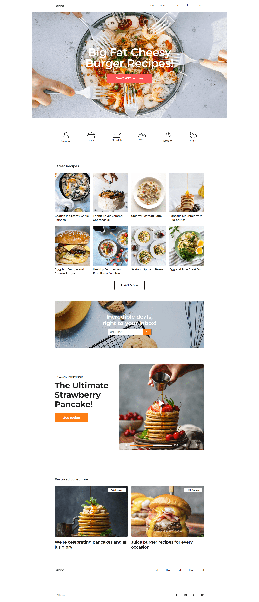

# Flex Kullanımı Geliştirme Projesi

Bu çalışmanın amacı, CSS flex kullanımını geliştirmek ve Figma tasarımını temel alarak bir web uygulaması oluşturmaktır.

## Tasarım

Tasarım, Figma üzerinde oluşturulmuş ve [buradan](https://www.figma.com/file/1kVoHFmkzc3pH4tQlNARPf/Fabrx-Web-Design-System-(V3)?type=design&node-id=878-101502&mode=design&t=WIp1pH29cE8L4lUN-0) erişilebilir. Aşağıda uygulama ekran görüntüsü bulunmaktadır:

## Not
Tasarımda responsive desteği bulunmamaktadır.

